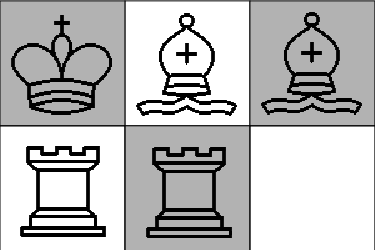
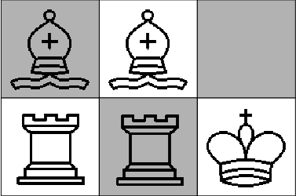

Mini Sakk
======================
* Feladatunk az  ábrán látható első sakkállásból a második sakkállásba eljutni. 
 A figurákkal a sakklépéseknek megfelelően lehet lépni.

* Bal a kezdőállapot, a jobb célállapot.
